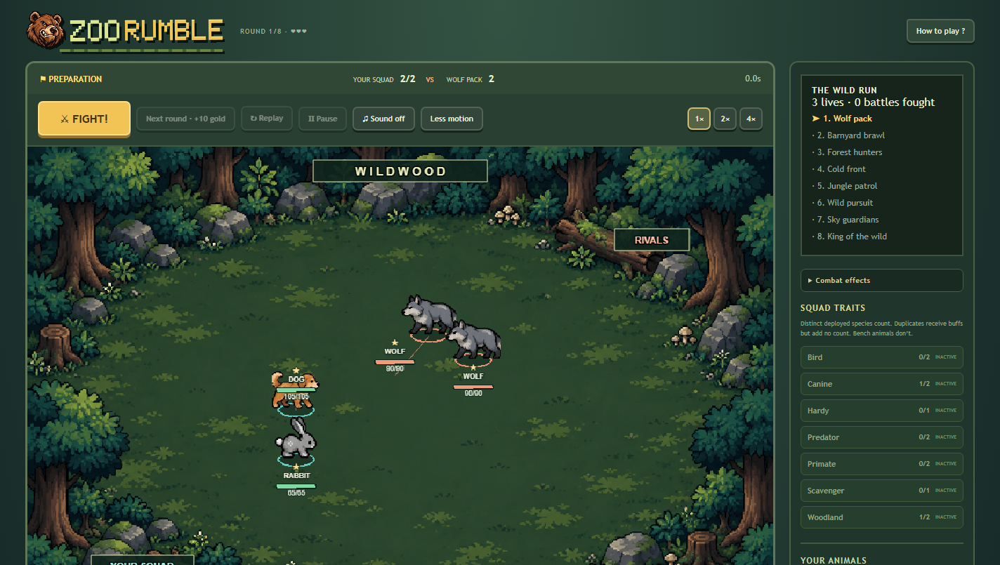
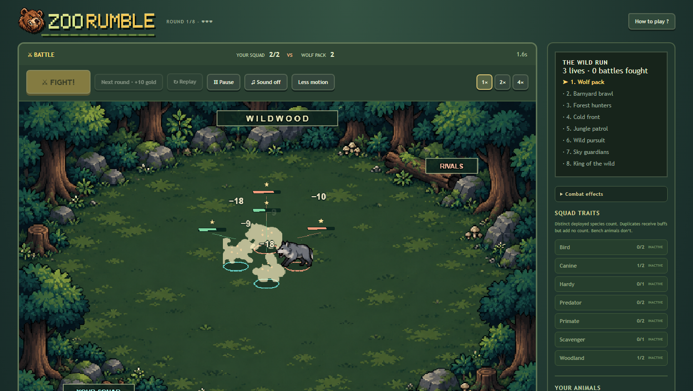

<p align="center">
  
</p>

<h1 align="center">Zoo Rumble</h1>

<p align="center">
  Build a squad of pixel animals, discover wild synergies, and watch them rumble through an eight-battle run.
</p>

<p align="center">
  <a href="LICENSE"></a>
  
  
  
  
</p>



## What is Zoo Rumble?

Zoo Rumble is a desktop-first browser auto battler with a compact roguelike run. Buy animals from a rotating shop, arrange them on an isometric woodland arena, combine matching copies into stronger stars, and build trait combinations that can survive eight escalating encounters.

Combat plays automatically, but the decisions before each fight are yours: which animals to buy, what to sell, when to level, how to position the squad, and which overlapping traits to pursue.

## Highlights

- **16 playable animals** with distinct stats, roles, traits, and abilities
- **Seven trait families** that reward different squad compositions
- **Three-star upgrades** through automatic three-copy merges
- **Eight encounters** with persistent lives, gold, XP, and squad progression
- **Deterministic combat** driven by fixed simulation ticks and seeded randomness
- **Isometric pixel battlefield** with directional sprites, attacks, particles, damage numbers, and death effects
- **Drag-and-drop squad building** across the board, bench, and shop selling area
- **Responsive controls** with keyboard placement, reduced motion, battle speeds, pause, and optional synthesized sound
- **Developer sandbox** for seeds, single-tick stepping, trait presets, and balance testing



## The game loop

1. Start with two random tier-one animals and ten gold.
2. Buy, sell, merge, level, and position your squad during preparation.
3. Press **Fight** and watch the deterministic battle play out.
4. Earn gold and XP, then adapt your squad for the next encounter.
5. Defeat the eighth encounter before losing all three lives.

Repeated animals receive active trait bonuses, but only distinct deployed species count toward trait thresholds. Positioning matters: movement is orthogonal, targeting is deterministic, and units cannot move through occupied cells.

## Run locally

### Requirements

- [Node.js 24](https://nodejs.org/) (`>=24.15.0 <25`)
- npm 12 or another package manager that respects `package-lock.json`

### Setup

```bash
git clone https://github.com/SergioTTF/zoo-rumble.git
cd zoo-rumble
npm install
npm run dev
```

Open the local URL printed by Vite, normally `http://127.0.0.1:5173`.

### Useful commands

```bash
npm run dev         # Start the development server
npm run test        # Run the simulation and run-system test suite
npm run typecheck   # Check TypeScript
npm run lint        # Check code and architecture boundaries
npm run evaluate    # Run seeded balance evaluations
npm run build       # Create a static production build in dist/
```

The production build uses relative asset paths and can be served from any static host.

## How it is built

| Layer             | Responsibility                                                     |
| ----------------- | ------------------------------------------------------------------ |
| `src/content`     | Animals, abilities, traits, encounters, and balance values         |
| `src/simulation`  | Framework-free deterministic combat engine                         |
| `src/run`         | Squad, shop, economy, upgrades, rewards, and encounter progression |
| `src/game/bridge` | Fixed-step runtime and presentation event delivery                 |
| `src/game/phaser` | Isometric battlefield, sprites, animation, and effects             |
| `src/app`         | React interface, controls, onboarding, shop, and results           |
| `src/stores`      | Zustand sandbox and run state                                      |

The simulation layer does not import React, Phaser, Zustand, browser APIs, or uncontrolled randomness. ESLint enforces these boundaries. Animations consume ordered events and snapshots but never determine combat outcomes.

## Combat model

- Battles advance in fixed 100 ms ticks.
- Movement resolves before attacks.
- Targets sort by distance, current health, and stable instance ID.
- Ready attacks sort by exact cooldown due time and stable instance ID.
- A 60-second timeout compares remaining-health ratio, survivors, then seeded RNG.
- Identical configurations and seeds produce identical event streams and results.

The test suite covers movement, blocked paths, targeting ties, cooldowns, lethal ordering, abilities, elimination, timeouts, upgrades, economy, traits, encounters, accessibility helpers, and deterministic replays.

## Project notes

- [Design notes](DESIGN_NOTES.md)
- [Art assets and provenance](docs/ART_ASSETS.md)
- [Directional art implementation](docs/DIRECTIONAL_ART_IMPLEMENTATION.md)
- [Balance evaluation](docs/MILESTONE_17.md)
- [Accessibility and responsive pass](docs/MILESTONE_18.md)
- [Onboarding and final presentation](docs/MILESTONE_19.md)

## Status

Zoo Rumble is a playable prototype built through its first complete game-loop and polish milestones. Balance values remain open to tuning, and future work can expand content, sound, encounter variety, and long-term progression.

## License

Released under the [MIT License](LICENSE).
